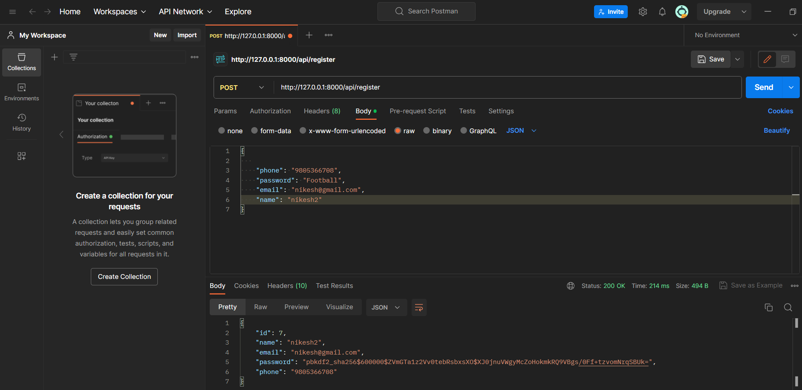
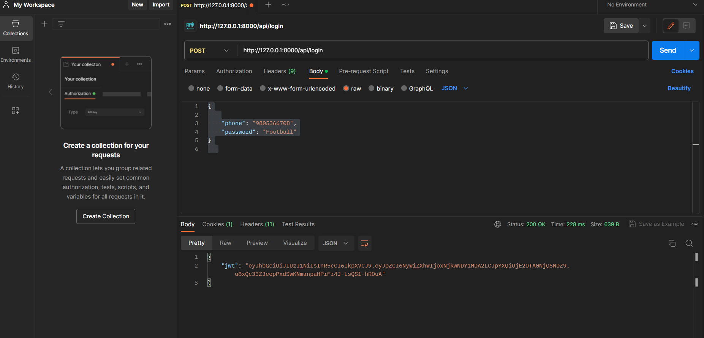
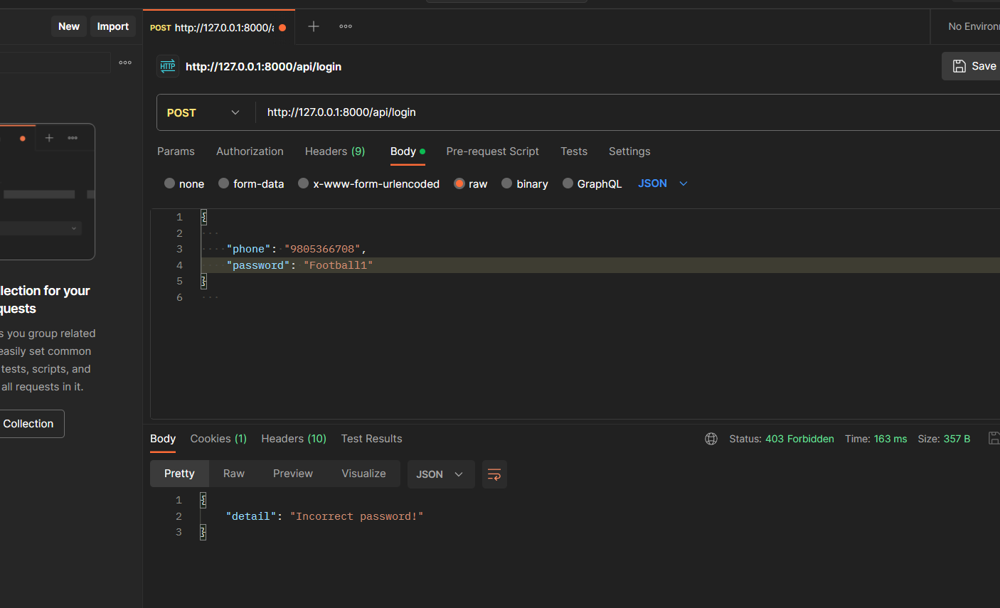
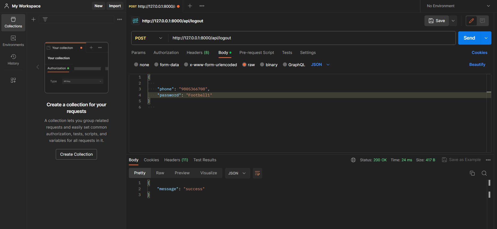

We have have register user by instering following name , email,phone and password and password is hashed by sha-56.

Token is stored after the login is successful.

If password or username is incorrect.

Logout successfulll.

for running
 1.pip install -r requiremnet.txt

for creating database set your database name in the setting.py

for refreshing or loading
 1.python manage.py makemigrations 
 2.python manage.py migrate

http://localhost:8000/api/register for register
http://localhost:8000/api/login for login
http://localhost:8000/api/logout for logut
http://localhost:8000/api/user for viewing a user

